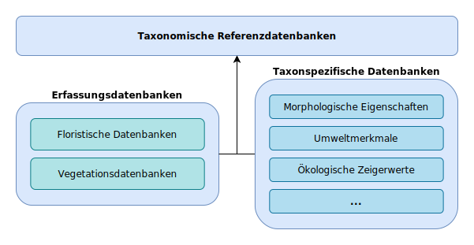
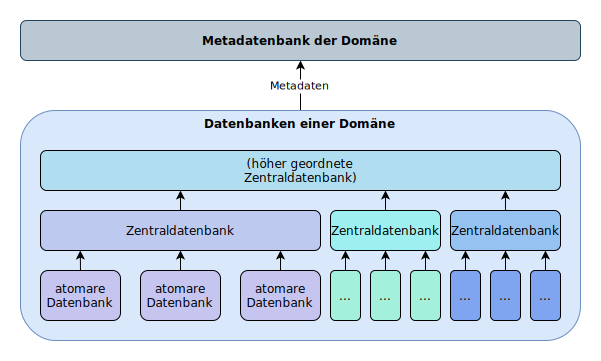

# Datenbanken in der Geobotanik

Die Biodiversitätsinformatik versteht sich als Querschnittsdisziplin, die den Bestand und die Entwicklung biologischer Vielfalt mithilfe von Werkzeugen der Informatik untersucht. Auch in der Geobotanik werden Datenbanken verwendet, um verschiedenartiges Wissen zu speichern und für die digitale Weiterverarbeitung nutzbar zu machen.

> _Beziehungen unterschiedlicher Datenbanken bei der Analyse mit Erfassungsdaten und taxonspezifischen Daten_

Zunehmend werden entsprechende Datenbanken über Programmierschnittstellen oder Downloads in elektronischer Form zugänglich gemacht. In der Floristischen Kartierung Mecklenburg-Vorpommern (Flora-MV) sind mehr als 1,2 Millionen Artfunde öffentlich durchsuchbar. Auf globaler Ebene werden Erfassungsdaten (und generell Daten zur Biodiversität) mit offenem Zugang durch die Global Biodiversity Information Facility gebündelt. Alleine für Pflanzen führt sie über 360 Millionen Angaben zu Artvorkommen. Für Vegetationsaufnahmen sind ähnliche Strukturen vorhanden.

Die Untersuchung der Daten hinsichtlich der Pflanzen-Umwelt-Beziehungen kann neue Möglichkeiten in der größerskaligen Bioindikation eröffnen. Dazu werden taxonspezifische Daten (z. B. Pflanzenmerkmale, ökologische Zeigerwerte) mit Erfassungsdaten verknüpft und ausgewertet.

## Begriff der Datenbank

Allgemein ist zu sagen, dass der Begriff der Datenbank nicht trennscharf verwendet wird. Eine Datenbank ist häufig eine Menge aus Tabellen, die über sogenannte Primärschlüssel miteinander verknüpft sind (relationale Datenbanken). Ein beliebter werdender Datenbanktyp sind die Graphdatenbanken, bei denen Knoten (Objekte) über Kanten (Beziehungen) miteinander verbunden sind.

Eine Datenbank kann auch eine einzige Tabelle oder eine andere Form der zweidimensionalen Repräsentation sein, die in einem „flachen“ Dateiformat (z. B. CSV, XML oder JSON) gespeichert ist. Im weiteren Sinne sind jedoch auch schriftliche Aufzeichnungen in tabellarischer Form als Datenbank zu verstehen.

## Hierarchie

Des Weiteren können Datenbanken innerhalb einer Domäne nach der Hierarchie unterschieden werden (siehe Abbildung). Die meisten Datenbanken haben einen konkreten Bezug zu einem Projekt und sind inhaltlich nicht aus weiteren Datenbanken (im Sinne elektronisch verfügbarer Datensätze) zusammengesetzt, ich nenne sie hier atomar.

_Schaubild zur Hierarchie von Datenbanken einer Domäne_

Werden die Datensätze aus mehreren Datenbanken zusammengeführt, spricht man von Zentraldatenbanken. Sie fassen solche Datenbanken zusammen, die räumlich-politisch (z. B. Region < Nation < Kontinent < Welt) oder inhaltlich (z. B. Lebermoose < Moose < Pflanzen) untergeordnet werden können. Sie können auch Bestandteil weiterer, hierarchisch übergeordneter Zentraldatenbanken sein.

Die zusammengefassten Datensätze müssen nicht identisch mit der Quelle sein: Während die Daten in manchen Zentraldatenbanken im Gesamten als Kopie übernommen und mit dem nötigen Vokabular zur Übersetzung in einen Standard versehen werden, werden sie bei anderen direkt in einen solchen Standard überführt. Bei letzteren gestaltet sich die Aktualisierung der Quellen schwierig und durch die wiederholte Interpretation der Daten sind Fehler schwerer nachzuvollziehen. Außerdem können Informationen atomarer Datensätze verloren gehen, wenn es keine entsprechende Repräsentation einzelner Felder in der Zieldatenbank gibt.

Metadatenbanken sammeln die Metadaten (z. B. Größe, räumlicher Bezug, Datenform) der Datenbanken einer Domäne. Dazu zählen Verfügbarkeit, Größe, und Abdeckung von Datenbanken. Ziele von Metadatenbanken sind, die Suche nach Datenbanken zu ermöglichen und Fortschritte und Lücken in der Digitalisierung einer Domäne darzustellen.

## Austauschformate

Alle Datenbanken sind nach einem (im Idealfall) klar definierten Datenmodell aufgebaut, das die Struktur der Daten beschreibt und die Formate definiert.

Wenn Daten zwischen zwei Datenbanken oder zwischen einer Datenbank und einer Anwendung ausgetauscht werden sollen, müssen die Daten oft von einem Datenmodell in ein anderes überführt werden. Dies kann entweder eine direkte Repräsentation des Datenmodells sein oder ein „flacheres“ Exportformat.

Im ungünstigsten Fall hat die Quelldatenbank eine eigene Repräsentation, exportiert die Daten in ein anderes Format, dieses wird wiederum in ein gebräuchliches Format umgewandelt, das dann von der Anwendung oder Datenbank gelesen und in die eigene Repräsentation überführt wird (fünf verschiedene Repräsentationen). Das klingt kompliziert und ist in der Umsetzung auch durchaus problematisch. Die Integrität der Daten kann mit jedem Umwandlungsschritt gefährdet werden.

Deshalb ist die Definition von Standards unabdinglich. Die Organisation Biodiversity Information Standards hat den offenen Standard Darwin Core für Biodiversitätsdaten entwickelt (Wieczorek et al. 2012). Dieser enthält auch eine Beschreibung für Erfassungsdaten. Für Vegetationsaufnahmen wurde der Standard Veg-X vorgeschlagen (Wiser et al. 2011).

## Literaturhinweise

**Wieczorek**, J.; Bloom, D.; Guralnick, R.; … Vieglais, D. (2012): Darwin Core: An Evolving Community-Developed Biodiversity Data Standard. In: PLOS ONE 7, e29715. <https://doi.org/10.1371/journal.pone.0029715>

**Wiser**, S.K.; Spencer, N.; De Cáceres, M.; … Peet, R.K. (2011): Veg-X – an exchange standard for plot-based vegetation data. In: Journal of Vegetation Science 22, 598–609. <https://doi.org/10.1111/j.1654-1103.2010.01245.x>
