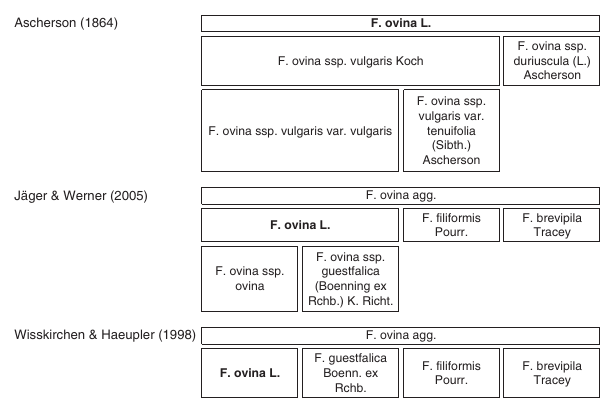

# Taxonomische Konzepte

Eine Einheit von Lebewesen, in die Individuen nach festgelegten Kriterien eingeordnet werden können, nennt man ein Taxon. Die Lebewesen eines Taxons müssen nicht stammesgeschichtlich näher verwandt sein, eine phylogenetisch korrekte Hierarchie ist jedoch ein Ziel der Taxonomie. Seitdem Carl von Linné die binominale Nomenklatur eingeführt hat, werden Taxa neu benannt, neu beschrieben oder im Umfang neu definiert.

Bei der Kartierung von Pflanzen wird in der Regel Bestimmungsliteratur als Referenz genutzt. Diese Referenzwerke stellen jedoch meist ein eigenes taxonomisches Konzept dar, d.h. es existieren unterschiedliche Sichtweisen, wie weit oder eng ein Taxon angegrenzt ist. Auch Zitate der beschreibenden Autor\*innen schaffen dem keine Abhilfe. Ein Veranschaulichung dieser Problematik am Beispiel des Schaf-Schwingels (Festuca ovina L.) haben Jansen & Dengler (2010) zusammengestellt:

_Darstellung unterschiedlicher Sichtweisen eines Taxons am Beispiel von Festuca ovina L._
(aus Jansen & Dengler 2010)

In manchen taxonomische Referenzdatenbanken werden diese unterschiedlichen Sichtweisen und Konzepte in Beziehung zueinander beschrieben. Sie führen eindeutige (akzeptierte) Taxa und deren Rangordnung. Sie stellen also selbst ein taxonomisches Konzept dar. Teilweise enthalten sie zusätzliche Informationen wie die Quellen der Erstbelege und Bilder von Herbaren. Durch die Referenzierung zu anderen Werken ermöglichen taxonomische Referenzdatenbanken den Vergleich und die Verbindung von Taxondaten jeglicher Art.

## Interpretation der Taxa

Um die Daten von Geländekartierungen für die weitere Analyse nutzbar zu machen, müssen zunächst die Namen aus der Kartierung interpretiert werden. Zusammen mit der Angabe des taxonomischen Konzepts kann eine Liste von referenzierten Taxa erstellt werden. Dafür sind weitere Referenzlisten (bei GermanSL heißen sie „Konzeptlisten“) notwendig, welche die Sippenbezeichnungen gebräuchlicher taxonomischer Konzepte enthalten und mit den Einträgen einer taxonomischen Referenzliste in Beziehung setzen. Die originalen Angaben sollten hier stets erhalten bleiben, um eventuelle Fehler oder Verallgemeinerungen bei der Interpretation nachträglich korrigieren zu können. (Jansen & Dengler 2008, 2010)

Für die eigentliche Analyse müssen die Daten weiter vorbereitet werden. Dies betrifft vor allem den Umgang mit unterschiedlichen Rängen und unsicheren Angaben. Dafür sind mehrere Methoden denkbar. (Jansen & Dengler 2010)

## Literaturhinweise

**Jansen**, F.; Dengler, J. (2008): GermanSL - Eine universelle taxonomische Referenzliste für Vegetationsdatenbanken in Deutschland. In: Tuexenia 28, 239–253.

**Jansen**, F.; Dengler, J. (2010): Plant names in vegetation databases – a neglected source of bias. In: Journal of Vegetation Science 21, 1179–1186. https://doi.org/10.1111/j.1654-1103.2010.01209.x
